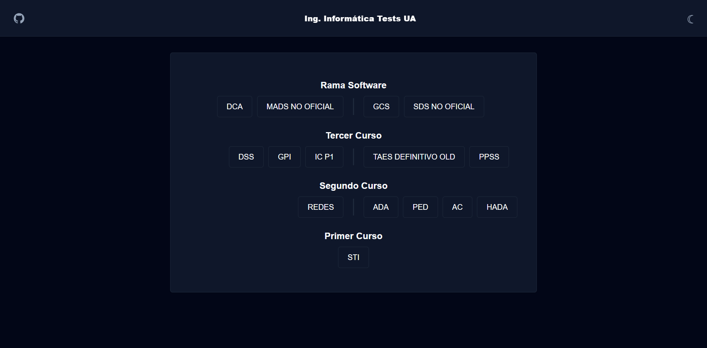
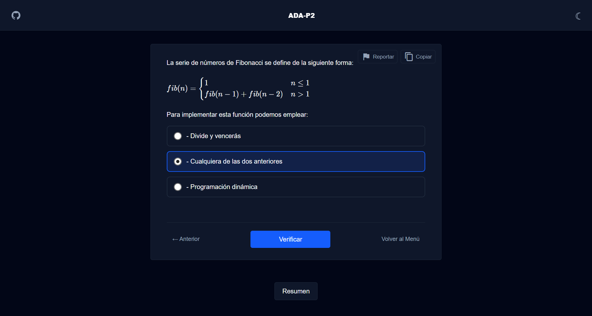
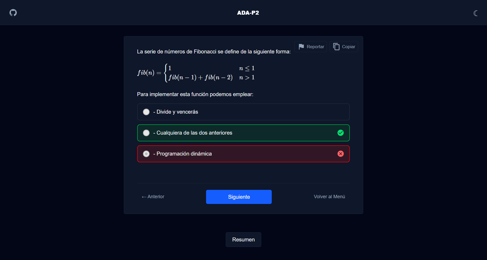
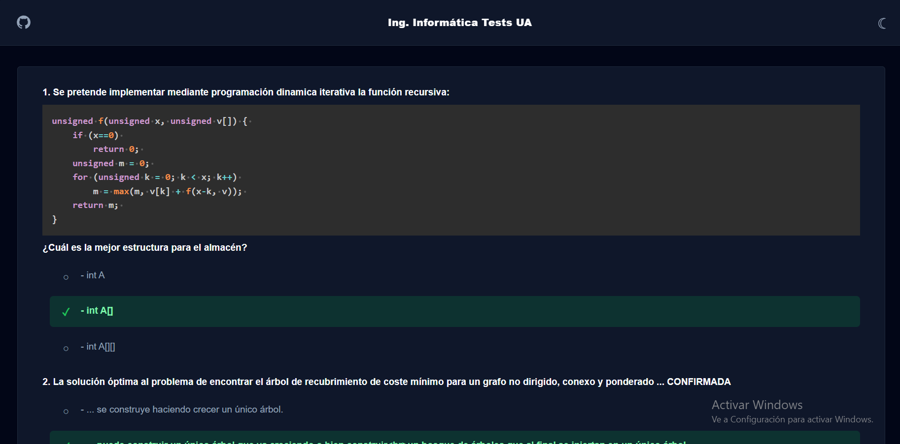

<div align="center">


<br/>
<br/>

<h1>📚 Informatica Test UA</h1>

<p align="center">
  <strong>Plataforma de preparación de exámenes para estudiantes de Ingeniería Informática de la Universidad de Alicante.</strong><br/>
  Batería de preguntas reales con retroalimentación inmediata, soporte LaTeX, bloques de código y modo oscuro.
</p>

<br/>

[](https://github.com)
[](LICENSE)
[](https://nodejs.org)
[](CONTRIBUTING.md)

</div>

---

## 📖 Tabla de Contenidos

- [Acerca del Proyecto](#-acerca-del-proyecto)
- [Características](#-características)
- [Tech Stack](#️-tech-stack)
- [Asignaturas Disponibles](#-asignaturas-disponibles)
- [Capturas de Pantalla](#-capturas-de-pantalla)
- [Inicio Rápido](#-inicio-rápido)
- [Estructura del Proyecto](#-estructura-del-proyecto)
- [Formato de los Datos](#-formato-de-los-datos)
- [Contribuir](#-contribuir)
- [Licencia](#-licencia)

---

## 🎯 Acerca del Proyecto

**Informatica Test UA** nació de la necesidad real de los estudiantes de la EPS (UA) de disponer de una herramienta de repaso centralizada, rápida y accesible sin depender de PDFs estáticos o aplicaciones de terceros genéricas.

El sistema carga baterías de preguntas extraídas de **exámenes y simulacros reales**, permite navegar libremente entre ellas conservando el estado de cada respuesta, y proporciona retroalimentación visual inmediata. Todo ello con soporte nativo para fórmulas matemáticas (`KaTeX`), bloques de código (`highlight.js`) y un diseño responsive que funciona igual de bien en móvil que en escritorio.

> [!NOTE]
> Este proyecto está en constante crecimiento. Si tienes preguntas de tu asignatura que no están incluidas, ¡los PRs son bienvenidos!

---

## ✨ Características

| Característica | Descripción |
|---|---|
| 📚 **Preguntas Reales** | Cientos de preguntas categorizadas por asignatura, convocatoria y año. |
| 🔀 **Orden Aleatorio** | Las preguntas y opciones se mezclan en cada sesión para evitar memorizar posiciones. |
| 🔙 **Navegación con Historial** | Navega hacia adelante y atrás sin perder las respuestas ya registradas. |
| ✅ **Retroalimentación Inmediata** | Indicación visual instantánea de acierto o error tras cada respuesta. |
| 📊 **Resumen Final** | Estadísticas detalladas al terminar: puntuación, aciertos, fallos y tasa de éxito. |
| 🌓 **Modo Oscuro / Claro** | Tema adaptativo basado en las preferencias del sistema operativo. |
| 🧮 **Soporte LaTeX** | Renderizado de fórmulas matemáticas complejas mediante `KaTeX`. |
| 💻 **Bloques de Código** | Sintaxis resaltada para fragmentos de código C++, pseudocódigo y más. |
| 📋 **Copiar al Portapapeles** | Copia enunciado, opciones y código con un clic para tus apuntes. |
| 📱 **Diseño Responsive** | Interfaz completamente adaptada a móvil, tablet y escritorio. |
| ⌨️ **Accesibilidad por Teclado** | Selecciona respuestas con las teclas numéricas `1–5` y confirma con `Enter`. |

---

## 🛠️ Tech Stack

| Tecnología | Versión | Propósito |
|---|---|---|
| [Astro](https://astro.build/) | `^5.0` | Framework SSR + Generación de rutas dinámicas |
| [Tailwind CSS](https://tailwindcss.com/) | `^4.2` | Sistema de diseño y estilos utilitarios |
| [KaTeX](https://katex.org/) | `^0.16` | Renderizado de fórmulas LaTeX en el cliente |
| [highlight.js](https://highlightjs.org/) | `^11.11` | Resaltado de sintaxis para bloques de código |
| [Marked](https://marked.js.org/) | `^17.0` | Parser Markdown para enunciados de preguntas |
| [Supabase JS](https://supabase.com/) | `^2.100` | Backend-as-a-Service (autenticación y BD) |
| [Vercel Adapter](https://docs.astro.build/en/guides/deploy/vercel/) | `^8.0` | Adaptador para despliegue serverless en Vercel |
| [jsPDF](https://github.com/parallax/jsPDF) | `^4.2` | Exportación de resultados a PDF |

---

## 📘 Asignaturas Disponibles

El sistema actualmente incluye baterías de preguntas para las siguientes asignaturas:

| ID | Asignatura | Convocatorias |
|---|---|---|
| `ada` | Algorítmica y Diseño de Algoritmos | Exámenes completos + parciales P1/P2 |
| `adi` | Administración de Internet | Banco general |
| `ac` | Arquitectura de Computadores | CT1-2, CT3-4, CP-F2, CP-F3, Prácticas |
| `dca` | Diseño de Circuitos y Aplicaciones | Oficial + No Oficial |
| `dss` | Diseño de Sistemas Software | Banco general |
| `gcs` | Gestión y Configuración de Software | P1 (oficial + no oficial), P2 |
| `gpi` | Gestión de Proyectos Informáticos | Banco general |
| `ic` | Ingeniería del Conocimiento | Parcial 1 |
| `mads` | Métodos Ágiles de Desarrollo Software | P1 + P2 (no oficial) |
| `ped` | Programación en Entornos Distribuidos | Banco general |
| `ppss` | Programación para Sistemas y Servicios | P1, P2, C4-2025 |
| `redes` | Redes de Computadores | Ene 23/24, 24/25, 25/26, Jul 24/25 + banco |
| `sds` | Seguridad en el Desarrollo de Software | Temas 01-14 |
| `si` | Sistemas de Información | Banco general |
| `sti` | Sistemas de Tiempo Real | Banco general |
| `taes` | Técnicas Avanzadas de Ingeniería del SW | Banco definitivo |

> **47 archivos de preguntas** · **+2.000 preguntas** disponibles en total (estimación)

---

## 📸 Capturas de Pantalla

<div align="center">
  
  <br/><em>Pantalla de inicio — selección de asignatura y modo de quiz</em>
  <br/><br/>
  
  <br/><em>Vista de pregunta activa con soporte de código y LaTeX</em>
  <br/><br/>
  
  <br/><em>Retroalimentación inmediata tras responder</em>
  <br/><br/>
  
  <br/>
  <em>Pantalla de resumen final con todas las preguntas</em>
</div>

---

## 🚀 Inicio Rápido

### Prerrequisitos

- **Node.js** `>=22.12.0` — [Descargar](https://nodejs.org/en/download)
- **npm** `>=10.x` (incluido con Node.js)

### Instalación

```bash
# 1. Clona el repositorio
git clone https://github.com/tu-usuario/informatica-test-ua.git

# 2. Accede al directorio del proyecto
cd informatica-test-ua

# 3. Instala las dependencias
npm install

# 4. Inicia el servidor de desarrollo
npm run dev
```

Abre `http://localhost:4321` en tu navegador. ¡Ya está listo!

### Scripts disponibles

| Comando | Descripción |
|---|---|
| `npm run dev` | Inicia el servidor de desarrollo con HMR en `localhost:4321` |
| `npm run build` | Genera el sitio estático/SSR optimizado para producción en `./dist/` |
| `npm run preview` | Previsualiza la build de producción localmente |

---

## 📂 Estructura del Proyecto

```
informatica-test-ua/
├── public/
│   └── resources/
│       ├── data/                    # 📄 Archivos .txt con las baterías de preguntas
│       │   ├── adaPreguntas.txt
│       │   ├── redesPreguntas.txt
│       │   └── ...                  # (47 archivos en total)
│       ├── js/
│       │   └── main.js              # ⚙️  Motor principal del quiz (Vanilla JS)
│       └── css/                     # Estilos de librerías externas (KaTeX, etc.)
├── src/
│   ├── components/                  # Componentes UI reutilizables (modales, etc.)
│   ├── layouts/
│   │   └── BaseLayout.astro         # Layout maestro con head, meta y scripts globales
│   ├── pages/
│   │   ├── index.astro              # Página de inicio — listado de asignaturas
│   │   ├── [subject].astro          # Ruta dinámica — vista de quiz por asignatura
│   │   └── [subject]/               # Subrutas (ej: resumen de resultados)
│   └── styles/
│       └── global.css               # Variables CSS globales y configuración Tailwind 4
├── astro.config.mjs                 # Configuración de Astro (output SSR + Vercel adapter)
├── package.json
├── tsconfig.json
└── README.md
```

---

## 📝 Formato de los Datos

Las preguntas se almacenan en archivos `.txt` dentro de `public/resources/data/` siguiendo este protocolo de formato:

```text
Enunciado de la pregunta (soporta Markdown completo)
<índice_respuesta_correcta>
- Opción A
- Opción B
- Opción C
- Opción D
```

### Reglas del formato

- **Respuesta correcta**: número entero (ej: `2`) o lista separada por comas para respuestas múltiples (ej: `1,3`).
- **Bloques de código**: usar triple backtick ` ``` ` con identificador de lenguaje opcional.
- **Fórmulas LaTeX**: encerrar entre `$$ ... $$` para renderizado con KaTeX.
- **Imágenes**: sintaxis Markdown extendida `{width=X height=Y}`.
- **Separación**: una línea en blanco entre preguntas.

### Ejemplo completo

````text
¿Cuál es la complejidad temporal del algoritmo de ordenación QuickSort en el caso promedio?

$$T(n) = O(n \log n)$$

2
- $O(n^2)$
- $O(n \log n)$
- $O(\log n)$
- $O(n)$

¿Qué imprime el siguiente fragmento de código?
```cpp
int x = 5;
cout << x++ << " " << ++x << endl;
```
3
- 5 7
- 6 7
- 5 6
- 6 6
````

---

## 🤝 Contribuir

Las contribuciones son lo que hace que la comunidad de código abierto sea un lugar increíble para aprender, inspirarse y crear. **Cualquier contribución es muy bienvenida.**

### ¿Cómo contribuir?

#### Añadir o corregir preguntas

1. Localiza (o crea) el archivo `.txt` correspondiente a la asignatura en `public/resources/data/`.
2. Respeta el [formato de datos](#-formato-de-los-datos) descrito arriba.
3. Verifica que el índice de respuesta correcta sea exacto.

#### Proponer mejoras de código o UI

1. Haz un **fork** del repositorio.
2. Crea una rama descriptiva para tu feature o fix:
   ```bash
   git checkout -b feature/nombre-de-la-feature
   # o para correcciones:
   git checkout -b fix/descripcion-del-bug
   ```
3. Realiza tus cambios y haz commits atómicos con mensajes descriptivos:
   ```bash
   git commit -m "feat: añadir soporte para respuestas múltiples en el resumen"
   ```
4. Sube los cambios a tu fork:
   ```bash
   git push origin feature/nombre-de-la-feature
   ```
5. Abre un **Pull Request** hacia la rama `main` describiendo los cambios realizados.

### Guía de estilo

- Sigue las convenciones de nomenclatura de archivos: `[id-asignatura]Preguntas.txt`.
- Mantén la fidelidad a las variables CSS definidas en `src/styles/global.css`.
- Los componentes nuevos deben ser accesibles por teclado.
- Evita añadir dependencias pesadas sin justificación previa.

> [!TIP]
> Antes de abrir un PR, ejecuta `npm run build` localmente para asegurarte de que no hay errores de compilación.

---

## 📄 Licencia

Distribuido bajo la licencia **MIT**. Consulta el archivo [`LICENSE`](LICENSE) para más información.

---

<div align="center">

Hecho con ❤️ por estudiantes de la <a href="https://www.ua.es"><strong>Universidad de Alicante</strong></a>

<br/>

<sub>¿Encuentras un error? <a href="https://github.com/tu-usuario/informatica-test-ua/issues/new">Abre un issue</a> · ¿Quieres contribuir? <a href="#-contribuir">Lee la guía</a></sub>

</div>
